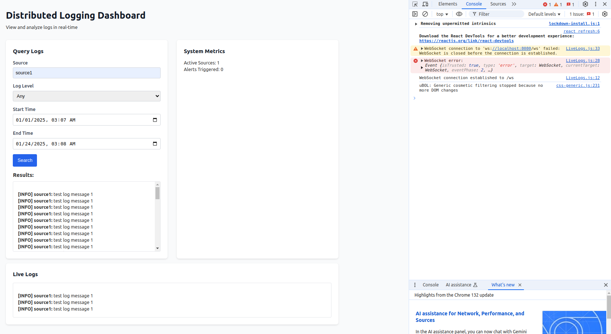
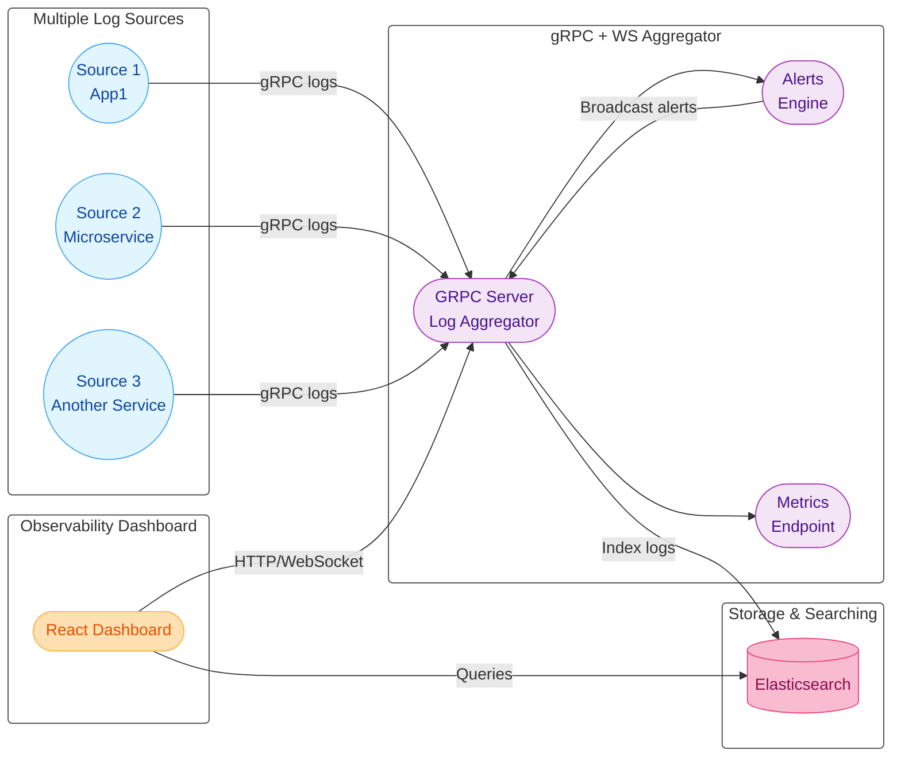

# Distributed Logging System / Log Aggregator

## Demo

## Design 

```mermaid
flowchart LR
    %% ---------- STYLE DEFINITIONS ----------
    classDef nodeStyle fill:#fff,stroke:#444,stroke-width:1px,color:#333,rx:4,ry:4
    classDef logSource fill:#e1f5fe,stroke:#42a5f5,stroke-width:1px,color:#0d47a1,rx:4,ry:4
    classDef aggregator fill:#f3e5f5,stroke:#ab47bc,stroke-width:1px,color:#4a148c,rx:4,ry:4
    classDef storage fill:#f8bbd0,stroke:#ec407a,stroke-width:1px,color:#880e4f,rx:4,ry:4
    classDef dashboard fill:#ffe0b2,stroke:#ffb74d,stroke-width:1px,color:#e65100,rx:4,ry:4

    %% ---------- NODES ----------
    subgraph A[Multiple Log Sources]
    S1((Source 1<br>App1)):::logSource
    S2((Source 2<br>Microservice)):::logSource
    S3((Source 3<br>Another Service)):::logSource
    end

    subgraph B[gRPC + WS Aggregator]
    GRPC([GRPC Server<br>Log Aggregator]):::aggregator
    Alerts([Alerts<br>Engine]):::aggregator
    MetricsEP([Metrics<br>Endpoint]):::aggregator
    end

    subgraph C[Storage & Searching]
    ES[(Elasticsearch)]:::storage
    end

    subgraph D[Observability Dashboard]
    ReactUI([React Dashboard]):::dashboard
    end

    %% ---------- CONNECTIONS ----------
    %% Log Sources --> Aggregator
    S1 -->|gRPC logs| GRPC
    S2 -->|gRPC logs| GRPC
    S3 -->|gRPC logs| GRPC

    %% Aggregator --> Storage
    GRPC -->|Index logs| ES

    %% Aggregator --> Alerts
    GRPC --> Alerts
    Alerts -->|Broadcast alerts| GRPC

    %% Metrics Endpoint
    GRPC --> MetricsEP

    %% Dashboard
    ReactUI -->|HTTP/WebSocket<br>| GRPC
    ReactUI -->|Queries<br>| ES

    %% ---------- STYLES ----------
    class A nodeStyle
    class B nodeStyle
    class C nodeStyle
    class D nodeStyle

    class S1,S2,S3 logSource
    class GRPC,Alerts,MetricsEP aggregator
    class ES storage
    class ReactUI dashboard
```
